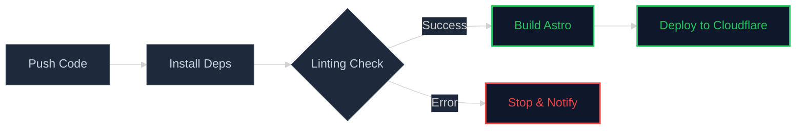

Dans un projet moderne, la rapidité ne doit jamais se faire au détriment de la qualité. Pour la refonte de mon portfolio sous **Astro**, j'ai décidé de mettre en place une véritable "Quality Gate" (barrière de qualité) qui empêche tout code instable d'atteindre la production.

## Pourquoi ESLint 9 ?

Le passage à **ESLint 9** et sa nouvelle "Flat Config" (`eslint.config.mjs`) permet une gestion beaucoup plus granulaire des règles de codage. Voici les piliers de ma configuration actuelle :

* **Zéro variable inutile** : La règle `no-unused-vars` est strictement appliquée pour garder un bundle léger.
* **Sécurité Astro** : Utilisation de `astro/no-set-html-directive` pour éviter les injections XSS accidentelles.
* **Complexité maîtrisée** : Une règle de complexité cyclomatique (`complexity`) limite la longueur des fonctions pour garantir la maintenabilité.

## Le Pipeline de Déploiement

Pour automatiser cette vérification, j'utilise **GitHub Actions**. À chaque `git push`, le pipeline exécute les étapes suivantes :

## Ce que cela m'apporte au quotidien

Grâce à ce workflow, je délègue la relecture de code de base à la machine. 
Si j'oublie un `console.log` ou si j'utilise un comparateur faible (`==` au lieu de `===`), le pipeline me l'indique immédiatement.

**Note DevOps** : Un pipeline qui échoue en local est une minute gagnée en production.

C'est la première brique d'une infrastructure robuste. 
La prochaine étape ? L'intégration de tests unitaires pour mes composants interactifs.